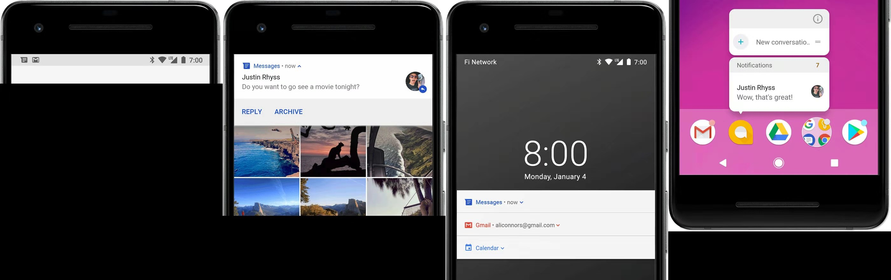

## 概述

通知是指Android在应用的界面之外显示的消息，旨在向用户提供提醒、来自他人的通信信息或应用中的其他实时信息。用户可以点按通知来打开应用，也可以直接在通知中执行某项操作，还可以下拉通知栏查看具体的通知扼要内容。

## 样式

通知在不同的位置有着不同的显示样式，主要表现位状态栏显示通知图标，通知栏中显示比较详细的条目，应用图标上的标志，锁屏界面显示的通知等样式

## 组成

1. 小图标：**必须提供**，通过 `setSmallIcon()` 进行设置
2. 应用图标：由系统提供
3. 时间戳：由系统提供，但您可以通过 `setWhen()` 将其替换掉或者通过 `setShowWhen(false)` 将其隐藏
4. 大图标：**可选内容**（通常仅用于联系人照片，请勿将其用于应用图标），通过 `setLargeIcon()` 进行设置
5. 标题：**可选内容**，通过 `setContentTitle()` 进行设置
6. 文本：**可选内容**，通过 `setContentText()` 进行设置

## 操作

### 跳转

点击通知栏中的内容，跳转到具体的页面，这已是一项被用户所接受的操作方式

### 展开

默认情况下，通知的文字内容会被截断以放在一行。如果您需要长一些的通知，可以通过应用其他模板启用更大的展开式文本区域（可以使用图片、收件箱样式、聊天对话或媒体播放控件来创建符合业务场景的展开式通知）

### 自定义

在实际场景中，我们需要根据需要自定义，比如：下载文件，我们应该在通知栏上，自定义暂停，删除等操作

## 其他

### 通知渠道

从Android 8.0（API 26）开始，**必须** 为所有通知分配渠道，否则通知将不会显示。

* 通过将通知归类为不同的渠道，用户可以停用你应用的特定通知渠道（而非停用你的所有通知），还可以控制每个渠道的视觉和听觉选项，所有的操作都在Android系统设置中完成
* 用户还可以长按通知以更改所关联渠道的行为
* 渠道还可用于指定通知的重要程度等级，因此，发布到同一通知渠道的所有通知行为都相同

在 Android 7.1（API 25）及更低版本的设备上，用户 **仅** 可以按应用来管理通知（API <= 25 设备上，每个应用其实 **只** 有一个渠道）

>一个应用可以有多个通知渠道（每个渠道对应于该应用发出的每类通知）。应用还可以创建渠道来响应用户对应用做出的选择，比如：可以为用户在短信应用中创建的每个会话组设置不同的通知渠道

### 通知更新

用户在你提供后续更新时不会遭遇多个通知或多余的通知轰炸，我们应该考虑更新现有通知（而不是发出新通知），或者考虑使用收件箱样式通知显示会话更新

### 通知分组

在Android7.0及更高的设备上可以将孤立的通知分为一组。借助通知分组，你可以以一条摘要的形式在抽屉式通知栏中将多个通知收拢成一条通知消息

### 重要程度

* 在 Android 8.0 及 **更高** 版本的设备上，通知的重要程度由通知发布到渠道的 `importance` 决定
* 在 Android 7.1 及 **更低** 版本的设备上，每条通知的重要程度均有通知的 `priority` 决定

重要程度等级如下所示：

* 紧急：发出提示音，并以提醒式通知的形式显示
* 高：发出提示音
* 中：无提示音
* 低：无提示音，且不会在状态栏中显示

>无论重要程度如何，所有通知都会在非干扰系统界面的位置显示，比如，显示在抽屉式通知栏中，以及在启动器图标上作为标志显示

### 勿扰模式

从Android 5.0（API 21）开始，用户可用启用勿扰模式，以关闭所有通知的提示音和振动。通知仍会在系统界面中照常显示，除非用户另有指定

勿扰模式包含 3 种不同的级别：

* 完全静音：阻止所有提示音和振动
* 仅限闹钟：阻止所有提示音和振动，闹钟除外
* 仅限优先事项：用户可以配置哪些系统级类别可以打扰他们（如仅限闹钟，提醒，活动，来电或短信等）。对于短信和来电，用户还可以选择根据发送者或来电者进行过滤

在 Android 8.0（API 26）及更高版本的设备上，用户还可以通过按渠道替换勿扰模式来允许特定于应用的类别（又称渠道）显示通知。例如：付款类应用可能会有与取款和存款相关的通知渠道。用户便可以选择允许在优先模式下显示取款通知和/或存款通知。

>在 Android 7.1（API 25）及更低版本设备上，用户可以按照应用（而不是按渠道）允许显示通知

### 前台服务

前台服务：一种长时间在后台运行且用户可察觉到的 `Service`，如媒体播放器

>这种通知不能像关闭其他通知那样关闭通知，关闭时，必须停止运行服务或者将其从“前台”状态中移除

### 发布限制

从Android 8.1（API 27）开始，应用无法每秒发出一次以上的通知提示音。如果应用在一秒内发出来多条通知，这些通知都会按照预期显示，但是每秒种 **只** 有第一条通知发出提示音

不过，Android 还对通知更新频率设定了限制。如果你过于频繁地发布有关某条通知的更新（不到一秒内发布了多个），系统 **可能会放弃部分** 更新

## 变化

### Android 4.1

* 推出了展开式通知模板（称为通知样式），可以提供较大的通知内容区域来显示信息，用户可以通过单指向 上/向 下活动的手势展开通知
* 支持以按钮的形式向通知添加其他操作
* 允许用户在设置种按应用关闭通知

### Android 5.0

* 推出了锁定屏幕和提醒式通知
* 用户现在可以将手机设为勿扰模式，并配置允许哪些通知在设备处于优先模式时打扰他们
* 向API集添加了通知是否在锁定屏幕上显示的方法（`setVisibility()`），以及指定通知文本的“公开”版本的方法
* 添加了 `setPriority()` 方法，告知系统通知的“干预性”（例如，将其设为“高”可使通知以提醒式通知的形式显示）
* 向 Android Wear（已更名为 Wear OS）设备添加了通知堆栈支持。使用 `setGroup()` 将通知放入堆栈。注意，平板电量和手机尚不支持通知堆栈。通知堆栈在以后会称为组或集合

### Android 7.0

* 重新设置了通知模板的样式以强调主打图片和头像
* 天记录三个通知模板
  * 一个用于短信应用
  * 另外两个用于借助展开式选项和其他系统装饰来装饰自定义内容视图
* 向手持设备（手机和平板电脑）添加了对通知组的支持。使用与Android 5.0 中推出的 Wear OS 通知堆栈相同的 API
* 用户可以使用内嵌回复功能直接在通知内进行回复（他们输入的文本将转发到通知的父级应用）

### Android 8.0

* 现在必须将各个通知放入特定渠道中
* 现在，用户可以按渠道关闭通知，而非关闭来自某个应用的所有通知
* 包含有效通知的应用将在主屏幕/启动器屏幕上相应应用图标的上方显示通知“标志”
* 现在，用户可以以抽屉式通知栏中暂停某个通知。你可以为通知设置自动超时时间
* 可以设置通知的背景色
* 部分与通知行为相关的 API 从 `Notification` 移至了 `NotificationChannel`，例如，在Android 8.0 集更高版本的设备中，使用 `NotificationChannel.setImportance()`，而非 `NotificationCompat.Builder.setPriority()`

## 参考

* [Notifications](https://developer.android.google.cn/guide/topics/ui/notifiers/notifications)
* [通知设计指南](https://material.io/design/platform-guidance/android-notifications.html)
